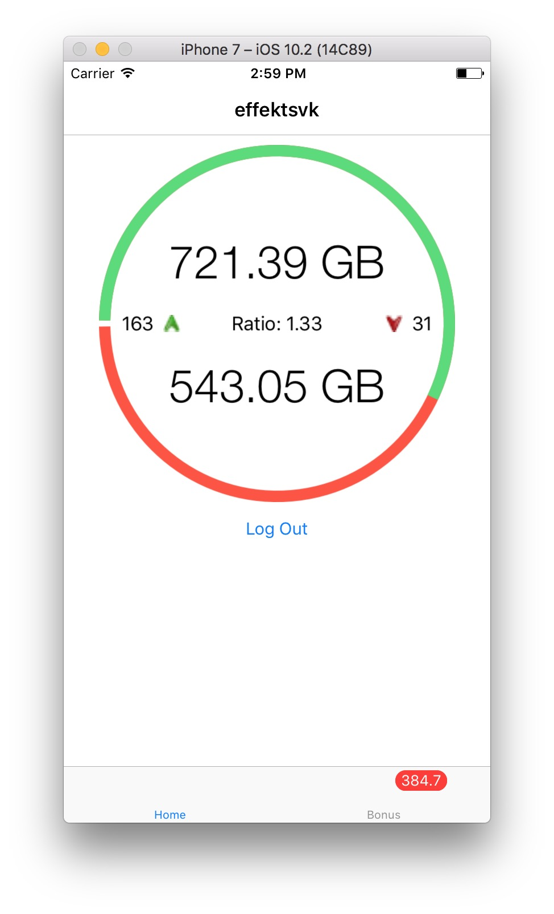
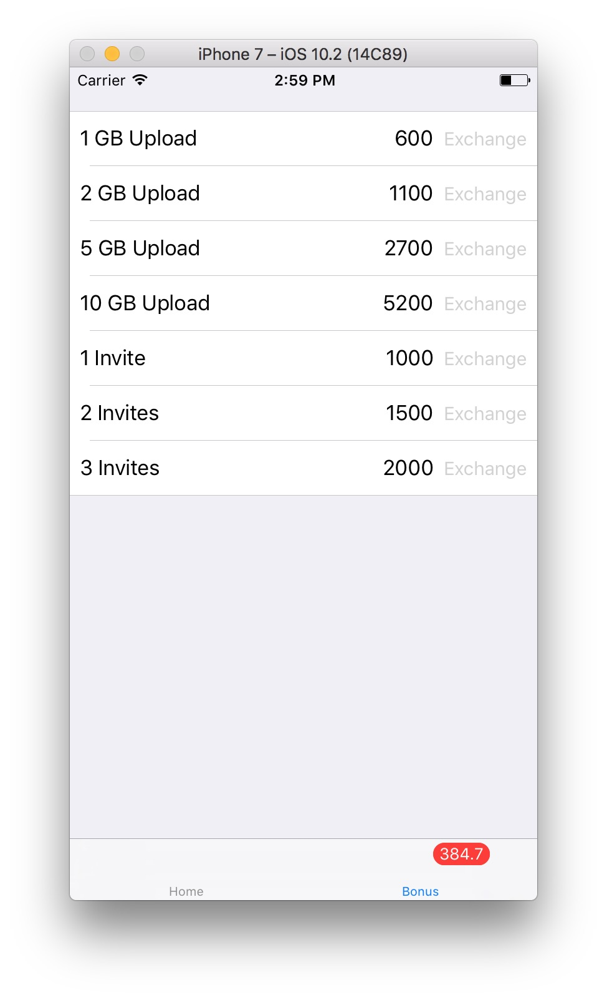

# HD-Space-iOS
This is an iOS app for private tracker HD-Space built in Swift

---
# Features
- Stats (Upload and download, ratio, active torrents and bonus)
- Bonus shop

---
# Installation
## Building
1. Download whole project
2. Open HD-Space.xcodeproj in Xcode
3. Connect your iPhone to your Mac
4. Choose your iPhone and click Run (Play) button to build the app

## iTunes Installation
[**Download**](https://github.com/effektsvk/HD-Space-iOS/releases/latest/) and install via iTunes.

---
# Known Issues
- ~~App crashes when you have 0 active torrents~~ (Fixed)

---
# Screenshots

